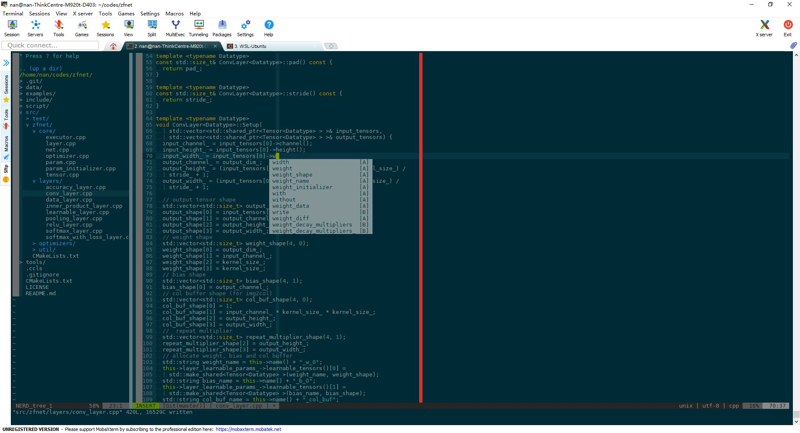

# Introduction

nan-neovim is a neovim configuration which is welcome to be used by others.
This confiuration is tested on [MobaXterm][https://mobaxterm.mobatek.net/]
based MS-Windows as local host and Ubuntu Server 20.04 as remote host.



# Install

* Install neovim
Download `nvim.appimage` from [NEOVIM][https://github.com/neovim/neovim/releases/] website.
Save it as `nvim` in a directory on your system `PATH`.

* Python virtual env
I make it by [miniconda][https://docs.conda.io/en/latest/miniconda.html].
```bash
$> conda create -n pynvim python=3.8
$> conda activate pynvim
$> pip install pynvim
$> which python
# config the return python path to neovim
let g:python3_host_prog="/path/to/conda/environment"
```

* Install ccls
``` bash
$> sudo apt-get install zlib1g-dev libncurses-dev
$> sudo apt-get install libncurses5
$> git clone --depth=1 --recursive https://github.com/MaskRay/ccls
$> cd ccls
# Download "Pre-Built Binaries" from https://releases.llvm.org/download.html
# and unpack to /path/to/clang+llvm-xxx.
# Do not unpack to a temporary directory, as the clang resource directory is hard-coded
# into ccls at compile time!
# See https://github.com/MaskRay/ccls/wiki/FAQ#verify-the-clang-resource-directory-is-correct
$> cmake -H. -BRelease -DCMAKE_BUILD_TYPE=Release -DCMAKE_PREFIX_PATH=/path/to/clang+llvm-xxx
$> cmake --build Release
```
create shell script `ccls` on `PATH` like:
```bash
#!/bin/sh
exec "$HOME/src/ccls/Release/ccls" "$@"
```
make this script executable.

* Install nan-neovim config
```sh
$> curl -sL install-node.now.sh/lts | sudo bash
$> git clone https://github.com/nannanmath/nan_neovim.git ~/.nan_neovim
$> cd .nan_neovim
$> ./install
```
Open `nvim` to install extensions for `coc.nvim` by `:CocInstall ext_name` where `ext_name` should be replaced by `coc-snippets`, `coc-highlight`, `coc-floaterm`, `coc-cmake`.
Config `coc.nvim` by editing `coc-settings.json`. Run `:CocConfig` and add follows.
```json
{
  "languageserver": {
    "ccls": {
      "command": "ccls",
      "filetypes": ["c", "cc", "cpp", "c++", "objc", "objcpp"],
      "rootPatterns": [".ccls", "compile_commands.json", ".git/", ".hg/"],
      "initializationOptions": {
        "cache": {
          "directory": "/tmp/ccls"
        },
        "client": {
          "snippetSupport": true
        },
        "highlight": {
          "lsRanges": true
        }
      }
    }
  },
  "snippets.ultisnips.directories": [
    "UltiSnips",
    "~/.nan_neovim/UltiSnips",
    "vim-snippets/UltiSnips" 
  ],
  "cmake.cmakePath": {
    "type": "string",
    "default": "cmake",
    "description": "The path to CMake generator executable" 
  }
}
``` 

# Usage

`<leader>` is `,`.

* Window
| Shortcut             | Action                              |
| -------------------- | -----------------------             |
| `<F4>`               | Toggle maximize / restore a window. |

* Directory explore
| Shortcut             | Action                              |
| -------------------- | -----------------------             |
| `<F2>`               | Toggle NERD Tree                       |
| `s`                  | Open buffer in horizental split window |
| `v`                  | Open buffer in vertical split window   |

* Comment function
| Shortcut             | Action                  |
| -------------------- | ----------------------- |
| `<leader>c<space>`   | Toggle comment state    |

* Undo & Yank
| Shortcut             | Action                        |
| -------------------- | -----------------------       |
| `<F6>`               | Show a Yank ring.             |
| `<F7>`               | Show a Undo tree in a window. |

* Term
| Shortcut             | Action                  |
| -------------------- | ----------------------- |
| `<F12>`               | Open a term.            |

* Completion & Snippets
These functions are implemented by [coc.nvim][https://github.com/neoclide/coc.nvim].


# 

